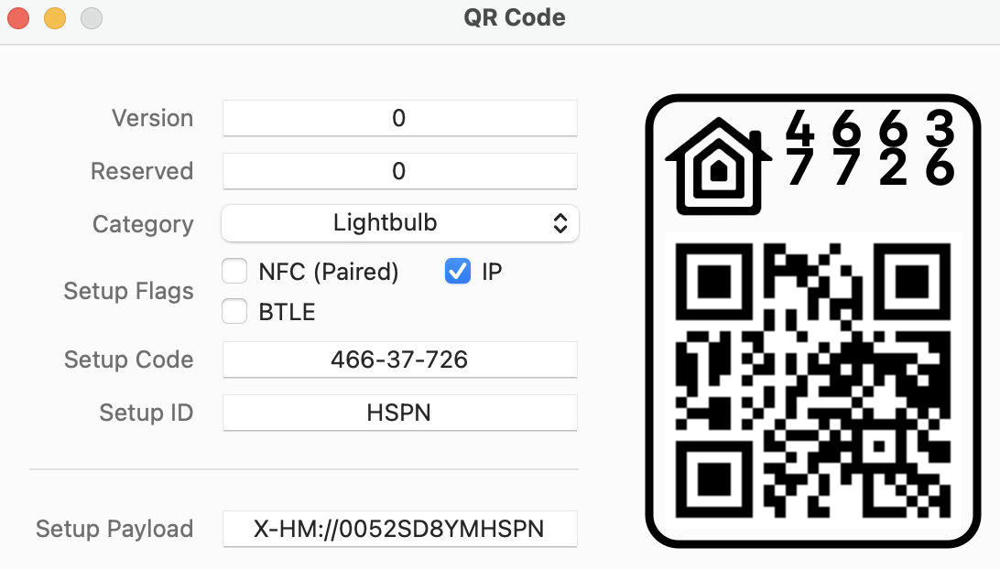

# Pairing with QR Codes

Pairing a HomeKit device using its 8-digit *Setup Code* requires you to:

* Select the specific HomeKit device to pair from a list of unpaired HomeKit devices the Home App finds on your local network
* Input the *Setup Code* for that device into the Home App.

The order of the steps above depends on whether you manually type the *Setup Code*, or scan it from a printed tag.

In contrast, pairing a HomeKit device with a **QR Code** requires you to only scan the QR Code.  You do not need to identify the device you want to pair.  The Home App will instead search for it on your local network and, if found, pair with it automatically.

This is possible because the QR Code includes a 4-character *Setup ID* that is unique to the device associated with the QR Code.  The QR Code also embeds other paring information about the device, such as its Category (e.g. Light, Fan, Door) and its 8-digit *Setup Code*.

HomeSpan supports pairing with QR Codes and uses "HSPN" as its default *Setup ID*.  However, if you have more than one device that you intend on pairing with a QR Code, you'll need to enure each has a unique *Setup ID*.  You can change the *Setup ID* on your device in one of two ways:

* Store a new code in the device NVS by typing 'Q \<code\>' into the HomeSpan [Command Line Interface](https://github.com/HomeSpan/HomeSpan/blob/master/docs/CLI.md); or
* Specify the QR *Setup ID* directly in your sketch using the method `homeSpan.setQRID(const char *ID)`. 
  
The order of preference is as follows:  If your sketch contains a call to `homeSpan.setQRID(const char *ID)`, the specified ID is used.  If not, HomeSpan will instead search the NVS for a stored *Setup ID*.  If not found, HomeSpan defaults to using "HSPN" as the *Setup ID*.
  
Note that if you do not intend on pairing your devices with QR Codes, it is fine for them to all retain the default *Setup ID* of "HSPN" since this ID is only used to initiate the pairing process via a QR code and serves no other purpose.

### Creating Scannable QR Codes

Just as you can create your own scannable tag based on a HomeSpan device's *Setup Code* (see the [HomeSpan User Guide](https://github.com/HomeSpan/HomeSpan/blob/master/docs/UserGuide.md#creating-a-scannable-tag), you can also create your own scannable QR Code for pairing a HomeSpan device.  Perhaps the easiest method is to use Apple's HomeKit QR Code generator including with its [HomeKit Accessory Simulator](https://developer.apple.com/documentation/homekit/testing_your_app_with_the_homekit_accessory_simulator) add-on for Xcode.

As shown above, the Simulator's QR Code Generator requires the input of the following fields:

* **Version**.  Always set this to zero, else the Home App will not recognize the QR Code.
* **Reserved**.  Always set this to zero, else the Home App will not recognize the QR Code.
* **Category**.  Set this to match the Category of your HomeSpan device (e.g. Lightbulb, Fan, Door Lock).  Note the Home App only uses this for display purposes when you first scan the QR Code.  The Home App does not actually check that the Category listed in the QR Code matches the Category of the device you are pairing.
* **Setup Flags**.  These flags provide information on which methods of pairing are supported by a HomeKit device.  HomeSpan only supports IP Pairing, so you check that box and leave the other two blank.  However, it does not seem to matter which boxes (if any) you check since the Home App does not appear to use this information for anything.
* **Setup Code**.  This is the 8-digit *Setup Code* you set for your device using either the [HomeSpan Command-Line Interface (CLI)](https://github.com/HomeSpan/HomeSpan/blob/master/docs/CLI.md) or [HomeSpan's WiFi Setup Web Page](https://github.com/HomeSpan/HomeSpan/blob/master/docs/UserGuide.md#setting-homespans-wifi-credentials-and-setup-code).  Note the code shown in the above screenshot is the default HomeSpan uses if you do not set your own.
* **Setup ID**.  This is the 4-character *Setup ID* you set for your HomeSpan device from within your sketch using the method `homeSpan.setQRID(const char *id)`.  If you do not specify a QR Setup ID in your sketch, HomeSpan uses a default value of "HSPN" (as shown in the example above) unless you've updated the default for this device via the [CLI](CLI.md) using the 'Q' command.  Note case matters!  HSPN is not the same as "hspn".
* **Setup Payload**.  This is the output that results from the above inputs, and is the text that is represented by the QR Code shown.  The Setup Payload for a HomeKit device always begins with "X-HM://", followed by 9 alphanumeric characters, and ending with the *Setup ID* in plain text.  If you've not changed HomeSpan's default *Setup Code* or *Setup ID*, you can pair your device by scanning this graphic with the Home App.  Even easier is to scan it right from your camera - your iPhone will recognize that this is a HomeKit QR Code and open the Home App for you.

You probably noticed that the QR Code contains extra graphics, such as Apple's HomeKit logo in the upper left.  This is purely cosmetic and not required by the Home App for pairing.  Similarly, having the device's 8-digit *Setup Code* shown in big numerals in the upper right is also cosmetic and not needed for pairing, though it may be handy if you have problems scanning the QR Code and want to manually type the *Setup Code* into the Home App.

The only portion of the full graphic actually scanned by the Home App is the QR Code itself, which means you can create a HomeKit-compatible QR Code using any generic QR Code generator that allows you to input arbitrary text.  The text you'll need to input to such a QR Code generator is of course the Setup Payload.  There is a relatively straightfoward algorithm you can follow to produce the correct Setup Payload text for each of your HomeSpan devices, but its even easier to let HomeSpan do this for you.

This is because HomeSpan automatically displays the Setup Payload text needed for a HomeSpan device on the Arduino Serial Monitor whenever you set or change the *Setup Code*.  **Simply copy the Setup Payload text shown on the Serial Monitor into a generic QR Code generator, and viola — you've created a scannable QR Code ready to be used to pair your HomeSpan device.**

### Setup Payload Algorithm (*optional reading*)

The Setup Payload for a HomeKit device always begins with "X-HM://", followed by nine base-36 digits that encode all the device's pairing parameters, and ending with the *Setup ID* for the device in plain text.

> Base-36 digits use the characters 0-9 and A-Z (capitals only!) to represent the numbers 0-35 in the same fashion that the hexidecimal digits 0-9 and A-F represent the numbers 0-15.  For example, the decimal number 91 would be represented as 2S in base-36 (91 = 2 * 36 + 19)

The nine base-36 digits should encode a 45-bit word formed from the following data elements (listed from most- to least-significant bit):

* Bits 45-43 -  The "Version" field (0-7).  Always set to 0
* Bits 42-39 -  The "Reserved" field (0-15).  Always set to 0
* Bits 38-31 -  The device's Accessory Category (0-255)
* Bit 30 -  Always set to 0
* Bit 29 -  Set to 1 if the device supports BLTE pairing, else set to 0
* Bit 28 -  Set to 1 if the device supports IP pairing, else set to 0
* Bit 27 -  Set to 1 if the device supports NFC pairing, else set to 0
* Bits 26-0 - The device's 8-digit *Setup Code* (from 0-99999999)

The result must be 9 digits. If less, pad with leading zeros.

---

[↩️](../README.md) Back to the Welcome page

