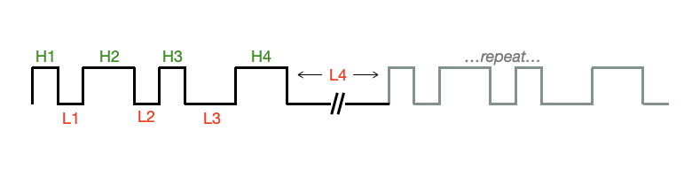

# Remote Control Radio Frequency / Infrared Signal Generation

The ESP32 has an on-chip Remote Control (RMT) signal-generator designed to drive an RF or IR transmitter.  HomeSpan includes a dedicated, easy-to-use class, **RFControl()**, that interfaces with the ESP32 RMT peripheral so that with a few additional electronic components you can create a HomeSpan device that controls an RF or IR appliance directly from the Home App on your iPhone, or via Siri.

## *RFControl(int pin, boolean refClock=true)*

Creating an instance of this **class** initializes the RF/IR signal generator and specifies the ESP32 *pin* to output the signal.  You may create more than one instance of this class if driving more than one RF/IR transmitter (each connected to different *pin*), subject to resource limitations.  The optional parameter *refClock* is more fully described further below under the `start()` method.

Signals are defined as a sequence of HIGH and LOW phases that together form a pulse train where you specify the duration, in *ticks*, of each HIGH and LOW phase, shown respectively as H1-H4 and L1-L4 in the following diagram:  



Since most RF/IR signals repeat the same train of pulses more than once, the duration of the last LOW phase should be extended to account for the delay between repeats of the pulse train.  Pulse trains are encoded as sequential arrays of 32-bit words, where each 32-bit word represents an individual pulse using the following protocol:

  * bits 0-14: the duration, in *ticks* from 0-32767, of the first part of the pulse to be transmitted
  * bit 15: indicates whether the first part of the pulse to be transmitted is HIGH (1) or LOW (0)
  * bits 16-30: the duration, in *ticks* from 0-32767, of the second part of the pulse to be transmitted
  * bit 31: indicates whether the second part of the pulse to be transmitted is HIGH (1) or LOW (0)

HomeSpan provides two easy methods to create, store, and transmit a pulse train.  The first method relies on the fact that each instance of RFControl maintains its own internal memory structure to store a pulse train of arbitrary length.  The functions `clear()`, `add()`, and `pulse()`, described below, allow you to create a pulse train using this internal memory structure.  The `start()` function is then used to begin transmission of the full pulse train.  This method is generally used when pulse trains are to be created on-the-fly as needed, since each RFControl instance can only store a single pulse train at one time.

In the second method, you create one or more pulse trains in external arrays of 32-bit words using the protocol above.  To begin transmission of a specific pulse train, call the `start()` function with a pointer reference to the external array containing that pulse train.  This method is generally used when you want to pre-compute many different pulse trains and have them ready-to-transmit as needed.  Note that this method requires the array to be stored in RAM, not PSRAM.

Details of each function are as follows:

* `void clear()`

  * clears the pulse train memory structure of a specific instance of RFControl

* `void phase(uint32_t numTicks, uint8_t phase)`

  * appends either a HIGH or LOW phase to the pulse train memory buffer for a specific instance of RFControl

    * *numTicks* - the duration, in *ticks* of the pulse phase.  Durations of greater than 32767 ticks are allowed (the system automatically creates repeated pulses of a maximum of 32767 ticks each until the specified duration of *numTicks* is reached)
    
    * *phase* - set to 0 to create a LOW phase; set to 1 (or any non-zero number) to create a HIGH phase
    
  * repeated phases of the same type (e.g. HIGH followed by another HIGH) are permitted and result in a single HIGH or LOW phase with a duration equal to the sum of the *numTicks* specified for each repeated phase (this is helpful when generating Manchester-encoded signals)

* `void add(uint32_t onTime, uint32_t offTime)`

  * appends a single HIGH/LOW pulse with duration *onTime* followed by *offTime* to the pulse train of a specific instance of RFControl.  This is functionally equivalent to calling `phase(onTime,HIGH);` followed by `phase(offTime,LOW);` as defined above

* `void enableCarrier(uint32_t freq, float duty=0.5)`

  * enables modulation of the pulse train with a "square" carrier wave.  In practice this is only used for IR signals (not RF)
  
    * *freq* - the frequency, in Hz, of the carrier wave.  If freq=0, carrier wave is disabled
    
    * *duty* - the duty cycle of the carrier wave, from 0-1.  Default is 0.5 if not specified

  * RFControl will report an error if the combination of the specified frequency and duty cycle is outside the range of supported configurations

* `void disableCarrier()`

  * disables the carrier wave.  Equivalent to `enableCarrier(0);`

* `void start(uint8_t _numCycles, uint8_t tickTime)`
* `void start(uint32_t *data, int nData, uint8_t nCycles, uint8_t tickTime)`

 * in the first variation, this starts the transmission of the pulse train stored in the internal memory structure of a given instance of RFControl that was created using the `clear()`, `add()`, and `phase()` functions above.  In the second variation, this starts the transmission of the pulse train stored in an external array *data* containing *nData* 32-bit words.   The signal will be output on the pin specified when RFControl was instantiated.  Note this is a blocking call—the method waits until transmission is completed before returning.  This should not produce a noticeable delay in program operations since most RF/IR pulse trains are only a few tens-of-milliseconds long
 
   * *numCycles* - the total number of times to transmit the pulse train (i.e. a value of 3 means the pulse train will be transmitted once, followed by 2 additional re-transmissions).  This is an optional argument with a default of 1 if not specified.
   
   * *tickTime* - the duration, in ***clock units***, of a *tick*.  This is an optional argument with a default of 1 *clock unit* if not specified.  Valid range is 1-255 *clock units*, or set to 0 for 256 *clock units*.  The duration of a *clock unit* is determined by the *refClock* parameter (the second, optional argument, in the RFControl constructor described above).  If *refClock* is set to true (the default), RFControl uses the ESP32's 1 MHz Reference Clock for timing so that each *clock unit* equals 1𝛍s.  If *refClock* is set to false, RFControl uses the ESP32's faster 80 MHz APB Clock so that each *clock unit* equals 0.0125𝛍s (1/80 of microsecond) 
   
* To aid in the creation of a pulse train stored in an external array of 32-bit words, RFControl includes the macro *RF_PULSE(highTicks,lowTicks)* that returns a properly-formatted 32-bit value representing a single HIGH/LOW pulse of duration *highTicks* followed by *lowTicks*.  This is basically an analog to the `add()` function.  For example, the following code snippet shows two ways of creating and transmitting the same 3-pulse pulse-train --- the only difference being that one uses the internal memory structure of RFControl, and the second uses an external array:

```C++

RFControl rf(11);  // create an instance of RFControl

rf.clear();        // clear the internal memory structure
rf.add(100,50);    // create pulse of 100 ticks HIGH followed by 50 ticks LOW
rf.add(100,50);    // create a second pulse of 100 ticks HIGH followed by 50 ticks LOW
rf.add(25,500);    // create a third pulse of 25 ticks HIGH followed by 500 ticks LOW
rf.start(4,1000);  // start transmission of the pulse train; repeat for 4 cycles; one tick = 1000𝛍s 

uint32_t pulseTrain[] = {RF_PULSE(100,50), RF_PULSE(100,50), RF_PULSE(25,500)};    // create the same pulse train in an external array
rf.start(pulseTrain,3,4,1000);  // start transmission using the same parameters
```
#### Diagnostic Messages

The **RFControl** class outputs *Error \[E\]* messages to the Serial Monitor based on the *Core Debug Level* selected when compiling the sketch using the Arduino IDE.  A non-fatal error message is produced when insufficient Channel resources prevent the creation of a new RFControl object.  Calls to the `start()` method for objects that failed to be properly created are silently ignored.

#### Resource Usage

The **RFControl** class relies on the ESP32's RMT peripheral to create the precise pulse trains required.  Since each instantiation of **RFControl** consumes an RMT channel, the number of **RFControl** objects you can instantiate (each controlling a separate transmitter attached to a specific pin) is limited to the number of RMT channels available as follows:

* ESP32 - 8 channels;
* ESP32-S2 - 4 channels;
* ESP32-S3 - 4 channels;
* ESP32-C3 - 2 channels;
* ESP32-C6 - 2 channels;

Note the **Pixel** class also uses the ESP32's RMT peripheral so any instances of **Pixel** will consume RMT channels as well (for example, on an ESP32-C3 you could create two Pixels, two RFControls, or one Pixel and one RFControl).

## Example RFControl Sketch

Below is a complete sketch that produces two different pulse trains with the signal output linked to the ESP32 device's built-in LED (rather than an RF or IR transmitter).  For illustrative purposes the tick duration has been set to a very long 100𝛍s, and pulse times range from of 1000-10,000 ticks, so that the individual pulses are easily discernable on the LED.  Note this example sketch is also available in the Arduino IDE under [*File → Examples → HomeSpan → Other Examples → RemoteControl*](../examples/Other%20Examples/RemoteControl).

```C++
/* HomeSpan Remote Control Example */

#include "HomeSpan.h"             // include the HomeSpan library

void setup() {     
 
  Serial.begin(115200);           // start the Serial interface
  Serial.flush();
  delay(1000);                    // wait for interface to flush

  Serial.print("\n\nHomeSpan RF Transmitter Example\n\n");

  RFControl rf(13);               // create an instance of RFControl with signal output to pin 13 on the ESP32

  rf.clear();                     // clear the pulse train memory buffer

  rf.add(5000,5000);              // create a pulse train with three 5000-tick high/low pulses
  rf.add(5000,5000);
  rf.add(5000,10000);             // double duration of final low period

  Serial.print("Starting 4 cycles of three 500 ms on pulses...");
  
  rf.start(4,100);                // start transmission of 4 cycles of the pulse train with 1 tick=100 microseconds

  Serial.print("Done!\n");

  delay(2000);

  rf.clear();

  for(int i=1000;i<10000;i+=1000)
    rf.add(i,10000-i);
  rf.add(10000,10000);
  
  Serial.print("Starting 3 cycles of 100-1000 ms pulses...");
  
  rf.start(3,100);                // start transmission of 3 cycles of the pulse train with 1 tick=100 microseconds

  Serial.print("Done!\n");
  
  Serial.print("\nEnd Example");
  
} // end of setup()

void loop(){

} // end of loop()
```

---

[↩️](../README.md) Back to the Welcome page
