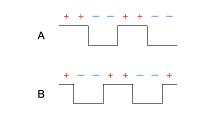
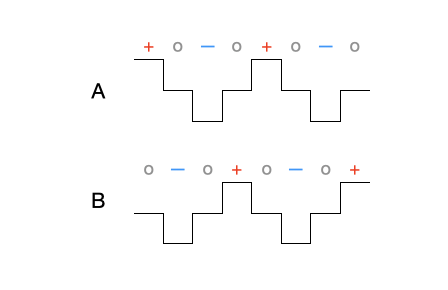
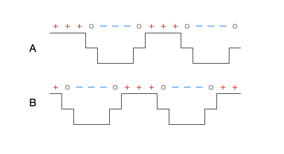

# Stepper Motor Modes

A typical 4-wire stepper motor has two sets of coils, *A* and *B*.  A driver chip, which usually contains two full-bridge circuits, independently controls the amount and direction of current flowing through each coil.  When current flows through one or both coils, a magnetic field is created with a repeating pattern of peaks and valleys.  The precise pattern depends on the amount and direction of the current in each coil.

A rotor at the center of the motor (which may itself be magnetic, or is constructed out of a ferromagnetic material such as iron) aligns itself with the valleys of the magnetic field created by the coils.  As long as current continues flowing, the magnetic field keeps the rotor in a fixed position, preventing the motor from being turned.

Changing the current through the coils changes the pattern of the magnetic peaks and valleys, which causes the rotor to move since it follows the valleys.  By repeatedly chaning the current through each coil in a specific pattern, you can cause the rotorcarefully choosing how to change the current flow, you can cause the rotor to make a small "step" in either the clockwise or counterclockwise direction.  Changing the current according to different patterns yields step sizes and different performance characteristics for thre of the motor.

type of "steps" the current in In this fashion the motor can be turned from one "step" to another.

