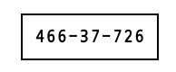
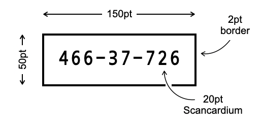

# HomeSpan User Guide
1. [Introduction](#introduction)
2. [Getting Started](#getting-started)
3. [HomeSpan Device States](#homespan-device-states)
4. [Device Configuration Mode](#device-configuration-mode)
5. [Setting HomeSpan’s WiFi Credentials and Setup Code](#setting-homespans-wifi-credentials-and-setup-code)
6. [Pairing to HomeKit](#pairing-to-homekit)
7. [Factory Reset](#factory-reset)
8. [Creating a Scannable Tag](#creating-a-scannable-tag)
9. [Status LED Flashing Reference](#status-led-flashing-reference)

## Introduction
This guide explains how to set up and configure a HomeSpan device that has already been programmed to operate one or more appliances, including how to:

* Determine the state of the device by observing the HomeSpan Status LED
* Use the HomeSpan Control Button
* Operate the device in Device Configuration Mode
* Connect the device to your home WiFi network and store your WiFi Credentials on the device
* Disconnect the device from your home WiFi network and erase your WiFi Credentials from the device
* Pair the device to Apple HomeKit
* Choose your own Setup Code for pairing the device to Apple HomeKit
* Unpair the device from Apple HomeKit
* Perform a Factory Reset

This guide does not cover the specific operation of any appliances being controlled by a HomeSpan device, such a light, fan, window shade, etc.  This document is also available as a [PDF file](./HomeSpanUserGuide.pdf) formatted to be printed as a double-sided booklet.

## Getting Started

***Welcome to HomeSpan!***

HomeSpan devices are designed from the ground up to work with Apple HomeKit, allowing you to control one or more appliances, such as a light, fan, or garage door, directly from the Home App on your iPhone or Mac, or with your voice by using Siri from an iPhone, Mac, or HomePod.

To use a HomeSpan device with HomeKit, the device must be:

1. Connected to your home WiFi network, and
1. Paired to your HomeKit account.

Since HomeSpan devices usually don’t have displays, HomeSpan tells you what it’s doing by blinking and flashing its Status LED in different patterns.  Likewise, since Homespan devices usually don’t have keyboards, you tell HomeSpan what you want it to do by pressing and holding its Control Button at different times and in different ways.

If you are new to HomeSpan and are configuring a new device for the first time, begin by reading through the first two sections below.  Then, follow the instructions in the second two sections to connect the device to your home WiFi network and pair the device to your HomeKit Account using your iPhone.

If you are setting up an existing device that has been previously configured in some unknown fashion, you may want to first perform a [Factory Reset](#factory-reset) to start with a fresh setup.

Enjoy!

## HomeSpan Device States

Before you can configure HomeSpan, you need to determine the state of the device.  HomeSpan devices indicate their state via the HomeSpan Status LED, which is either on, off, blinking, or flashing, according to the device’s current state.   The 4 main states of the device are:

#### NO‑WIFI

If the Status LED blinks once every 3 seconds, the device is lacking any stored WiFi Credentials and therefore cannot connect to a WiFi network.  This is the normal state of a new device as well as any device that has had its WiFi Credentials erased.  See [Setting HomeSpan’s WiFi Credentials and Setup Code](#setting-homespans-wifi-credentials-and-setup-code) to learn how to input and store your home network’s WiFi name and WiFi password on the device.

#### READY‑TO‑PAIR

If the Status LED blinks twice every 3 seconds, the device is connected to a WiFi network but is not yet paired to Apple HomeKit.  See [Pairing to HomeKit](#pairing-to-homekit) for instructions on how to pair your device to Apple HomeKit.

#### PAIRED

If the Status LED is steady ON, the device is connected to a local WiFi network and is paired to Apple HomeKit.  A device in this state should be fully operational.

#### CONNECTING

If the Status LED is repeatedly flashing ON for 1 second and then OFF for 1 second, the device is actively seeking to connect to a WiFi network using the WiFi Credentials stored on the device.   The device will remain in this state until:

* HomeSpan successfully connects to a WiFi network;
* you modify or erase the device's WiFi Credentials and restart HomeSpan via the [Device Configuration Mode](#device-configuration-mode) below;
* you perform a [Factory Reset](#factory-reset).

Note that the Status LED is always active, so if the LED is completely off (not even blinking), the device is not powered!

## Device Configuration Mode

The Device Configuration Mode allows you to perform various configuration operations.  Device Configuration Mode can be accessed when the device is in any of the following states:  **NO‑WIFI**, **READY‑TO‑PAIR**, or **PAIRED**.

To enter Device Configuration Mode, press and hold the Control Button for 3 seconds, at which point the Status LED should begin to flash rapidly (10 times per second).  Upon releasing the button the device will switch into the Device Configuration Mode.

Within Device Configuration Mode you can choose one of five possible Actions:

1. *Exit Device Configuration Mode*.  If you have unintentionally entered Device Configuration Mode, select this action to exit and return to the previous state.

1. *Reboot the device*.  If the device is not operating as expecting, a simple reboot often corrects error.

1. *Launch HomeSpan’s temporary WiFi network*.  HomeSpan’s temporary WiFi network provides a simple web interface for you to input your home network’s WiFi credentials and (optionally) create your own HomeKit Setup Code.  See [Setting HomeSpan’s WiFi Credentials and Setup Code](#setting-homespans-wifi-credentials-and-setup-code) for step-by-step instructions.

1. *Unpair the device from Apple HomeKit*.  Under normal operation, you control the pairing and unpairing of all HomeKit devices from the Home App on your iPhone or Mac. However, there are some circumstances in which a device may need to be manually unpaired.  This is typically done by performing a full [Factory Reset](#factory-reset) of the device, but that also deletes your WiFi Credentials.  This action allows you to unpair the device while preserving all other device settings.

1. *Erase stored WiFi Credentials*.  This allows you delete your WiFi Credentials from the device without losing any HomeKit pairing data, after which the device can be set up with new WiFi Credentials.

When the Device Configuration Mode is first started, the Status LED will blink once per second to indicate Action 1 has been selected.  To select the Action 2, briefly press and release the Control Button.  The Status LED will now exhibit a double-blink pattern with a one second pause between blinks, indicating Action 2 has been selected.  Each press of the Control Button selects the next action and causes the Status LED to blink according to the Action number.  Pressing the Control Button once you reach Action 5 brings the selection back to Action 1.

To execute the selected Action press and hold the Control Button for 3 seconds, at which time the Status LED will begin to flash rapidly (10 times a second).  Upon releasing the button HomeSpan will perform the Action selected, and the Status LED will change patterns to reflect the new state of the device after the Action has been taken.

If no Action has been executed within 120 seconds (2 minutes) of starting the Device Configuration Mode, Action 1 is automatically executed and the Device Configuration Mode is exited.

##	Setting HomeSpan’s WiFi Credentials and Setup Code

To configure a HomeSpace device to connect to your home WiFi network you must first connect your iPhone directly to the device so you can input your WiFi Credentials.   This connection is made via a temporary WiFi network HomeSpan launches just for this purpose.

To launch HomeSpan’s temporary WiFi network, enter [Device Configuration Mode](#device-configuration-mode) and execute Action 3.   After Action 3 is executed, the Status LED pattern will change to a rapid double-blink (twice per second), confirming the temporary WiFi network has started.

Next, navigate to Settings → Wi-Fi on your iPhone and select the ***Homespan-Setup*** network.  Then, enter ***homespan*** as the password and click Join.  The Status LED will confirm when you’ve successfully connected to the device by noticeably slowing its double-blinking pattern to repeat every two seconds, instead of twice per second.

A short time after the connection is confirmed, your iPhone should automatically load the HomeSpan Setup web page.  Select your WiFi network from the drop-down box, input your WiFi password, and click `SUBMIT` to proceed.  Alternatively, you can click `CANCEL` to terminate the setup process, in which case HomeSpan closes down its temporary WiFi network and reboots the device without making any changes.

Once you click `SUBMIT`, HomeSpan will verify your WiFi Credentials by attempting to connect to the WiFi network you selected.  At this time the Status LED will begin flashing ON for 1 second and then OFF for 1 second to indicate the device is trying to connect.  If the device fails to connect, it retries every 5 seconds until it either succeeds in connecting, or you click CANCEL (which brings you back to the HomeSpan Setup page).

If HomeSpan succeeds in connecting to your WiFi network, it will open a new web page reporting its success.  This same page also provides you with the opportunity to modify the Setup Code that HomeSpan uses to pair the device to Apple HomeKit.   You may select your own  8-digit code or leave the field blank to retain the current Setup Code.  First time users may wish to leave this field blank, in which case HomeSpan will use its default Setup Code (see [Pairing to HomeKit](#pairing-to-homekit) for details on the default Setup Code).  Note that you can always change this at a later date.

Also note that Setup Codes cannot be displayed by HomeSpan at any time, so please make sure to write down whatever code you choose for later use when you pair your device to Apple HomeKit.

If you are satisfied with your changes, click `SAVE` to complete the setup process.  HomeSpan will close down its temporary WiFi network and reboot the device in the **CONNECTING** state as it tries to connect to your WiFi network using the WiFi Credentials you just saved.  Alternatively, click `CANCEL` to reboot the device without making any changes.

Note that the temporary WiFi network only remains active for 300 seconds (5 minutes).  If you’ve not completed the setup process within that time, HomeSpan automatically terminates its temporary WiFi network and reboots the device without making any changes.

You can also force a termination of the setup process at any time by pressing and holding the Control Button for 3 seconds, at which time the Status LED will begin to flash rapidly (10 times per second).  Upon releasing the button HomeSpan will close down its temporary WiFi network and reboot the device without making any changes.

##	Pairing to HomeKit

HomeSpan devices can be paired to Apple HomeKit anytime the device is in the **READY‑TO‑PAIR** state.  If the device is in the **NO‑WIFI state**, it must first be connected to your home WiFi network before it can be paired to HomeKit (see [Setting HomeSpan’s WiFi Credentials and Setup Code](#setting-homespans-wifi-credentials-and-setup-code)).  If the device is already in the **PAIRED** state but it is not appearing in HomeKit, you may need to manually unpair the device so it can be re-paired.

To reduce the possibility that a bad actor can remotely pair with a HomeKit device and take over control, HomeKit requires the use of a device-specific Setup Code to authorize the pairing process.  This unique 8-digit code is not stored on the device itself (to prevent a hacker from extracting the code), but is usually found written on a tag attached to the device.  Only someone who has physical access to the tag will know the Setup Code and therefore be able to pair the device to HomeKit. 

The first time HomeSpan is run on a new device, it defaults to using **466-37-726** for its Setup Code.   A scannable tag containing HomeSpan’s default Setup Code is provided below for convenience during the pairing process:

This code is retained even if the device is Factory Reset.  However, as described above, you can (and should) modify it to something unique when you first set up the device, or at any point if you lose the Setup Code, or if someone else set up the device and you don’t know the code they used.  See [Setting HomeSpan’s WiFi Credentials and Setup Code](#setting-homespans-wifi-credentials-and-setup-code) for details on how to modify the Setup Code.  Also, see [Creating a Scannable Tag](#creating-a-scannable-tag) for steps on how to create a scannable tag based on the code you’ve chosen.  Note this is purely optional.  HomeKit does not require a scannable version of a device’s Setup Code.

To start the pairing process, open the Home App on your iPhone, select Add Accessory (in iOS 14 this is found under the + icon in the upper right of the Home App), and follow the iPhone’s instructions for scanning the Setup Code.

* If you have not modified the default Setup Code, scan the tag above.
* If you have modified the Setup Code, and have also created a scannable tag with that code, scan it now.
* If you have modified the Setup Code but have not created a scannable tag, select the option that indicates you can’t scan your code, in which case you will be able to type it manually later in the process.

The Home App should next display a list of available HomeKit accessories.  Select your HomeSpan device (if does not appear, exit the process and try again).

If you’ve already scanned the Setup Code for this device from a scannable tag, the Home App will begin the pairing process.  If not, it will now ask you to enter it manually.

Note that HomeSpan is not a commercial device and is therefore not certified by Apple.  The Home App will warn you of this and ask whether you still want to add the accessory.  Assuming that you say yes, the Home App will then complete the process of adding your HomeSpan device to HomeKit as a new accessory, group of accessories, or bridge. 

Follow any remaining Home App instructions to complete the process.  The Status LED on the device will turn to steady ON to confirm it is in the **PAIRED** state as soon as the process completes.  Shortly after, your HomeSpan device should appear as a new tile (or tiles) in the Home App ready for you to control.  Congratulations!  Your device is now fully operational.

## Factory Reset

The device can be Factory Reset when it is in any of the following states:  **NO‑WIFI**, **READY‑TO‑PAIR**, or **PAIRED**.  To initiate a Factory Reset, press and hold the Control button for 10 seconds.  After three seconds the Status LED will begin to flash rapidly (10 times per second).  Do not release the button yet, or HomeSpan will enter Device Configuration Mode!

After 10 seconds the Status LED will turn off.  Upon releasing the Control Button, HomeSpan will proceed to erase all stored WiFi Credentials and all HomeKit pairing data (except for the HomeKit Setup Code), after which it reboots the device.

## Creating a Scannable Tag

*This section is purely optional*.

Scannable tags, such as the one shown above containing HomeSpan’s default Setup Code, require a special Apple font called *Scancardium*, and a correctly-proportioned border.  Fortunately, this is very easy to create on a Mac since Apple includes a file with this font as part of the operating system, though it needs to first be installed to use it in *Pages* or *Keynote*.

To install, open Finder on your Mac and go to the following folder:

`/System/Library/PrivateFrameworks/CoreRecognition.framework/Resources/Fonts`

Next, double-click the file **Scancardium_2.0.tff**, which opens it in *Font Book*.  Then, within *Font Book*, click `Install Font`.  *Scancardium* is now ready to use.

To create the scannable tag, construct a simple text box with a border in either *Pages* or *Keynote* using the following dimensions:

The box can be bigger or smaller as long as you keep the same proportions.  For example, a 10pt font can be used with a box that is 75pt wide and 25pt high with a 1pt border.  Don’t forget to center-align your text and include the required hyphens as shown.  The result is a tag that can be scanned by HomeKit during the pairing process.

Note that if you can’t find *Scancardium* listed as a font choice in either the *Pages* or *Keynote* font dropdown boxes, select Format → Font → Show Fonts from the menu bar of the *Pages* or *Keynote* application to bring up a list of all installed fonts where you can search for, and select, *Scancardium*.

## Status LED Flashing Reference

If a status LED has been connected and configured, HomeSpan will use flashing code to indicate different status.

| Flash pattern               | Description                                                                |
| --------------------------- | -------------------------------------------------------------------------- |
| LED off, no flashing        | By default, no power, unless `setStatusAutoOff(timeout)` has been defined. |
| LED on, no flashing         | All good. Device is connected to WiFi and paired. See [PAIRED](#paired).   |
| 1-second flash every second | Attempting to connect to WiFi. See [CONNECTING](#connecting).              |
| 1 flash every 3 seconds     | No WiFi. See [NO-WIFI](#nowifi).                                           |
| 2 flashes every 3 seconds   | See [READY-TO-PAIR](#readytopair).                                         |
| 10 flashes per second       | The Control button is pressed. Once released, HomeSpan will either - Enter [Device Configuration Mode](#device-configuration-mode). - Exit _Device Configuration Mode_ executing the action selected based on the number of flashes.|

---

[↩️](../README.md) Back to the Welcome page

 
